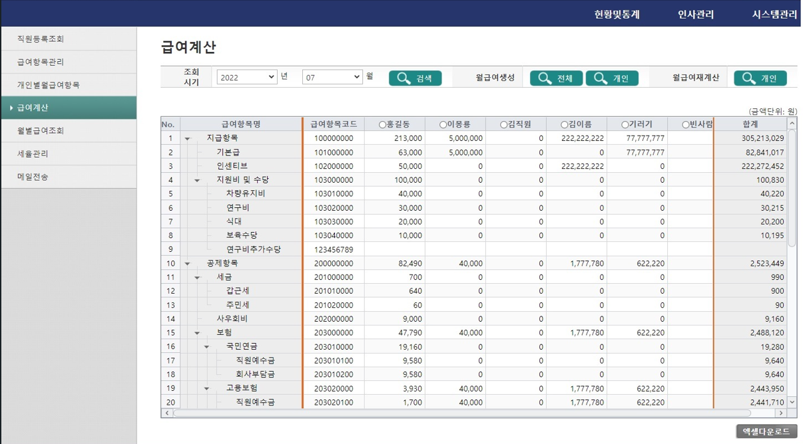

# 실무자 협업 프로젝트 - 
# 중소기업형 인사급여휴가관리시스템

> 개발 기간 : 2022.08.09 ~ 2022.12.12 
> 개발 인원 : 5명

## 📑 목차

1.  [프로젝트 기획 배경](#프로젝트-기획-배경)
2.  [주요 기능 설명](#주요-기능-설명)
3. [기술 스택](#기술-스택)
4. [아키텍처](#아키텍처)
5. [ERD](#erd)
6. [인터페이스](#인터페이스)
7. [수행 범위](#수행 범위)
8. [팀원 소개 및 역할](#팀원-소개-및-역할)

## 📌프로젝트 기획 배경
- 기업에서 사용하는 인사, 급여, 휴가 관리 시스템을 구축하는 업무로서, 직원 등록, 급여 항목 관리, 급여 내역 생성, 급여 변경 내역 관리 등의 업무를 
테크블루제닉이 보유한 전자정부 프레임워크 플랫폼을 사용하여 구축하는 작업

## 🔎주요 기능 설명

- 직원 등록/조회
  - 인사 데이터 처리의 기본이 되는 직원 기본 정보를 등록하고 수정하는 기능 (입사 -> 퇴사)
  - 입력된 직원 정보를 부서별, 개인별로 조회
  - 인사 데이터 변동 내역 조회

- 급여 항목 등록/조회
  - 회사별 다른 급여 항목을 등록하는 기능
  - 지급 항목과 공제 항목을 기준으로 트리뷰로 화면 제작
  - 급여 항목별로 금액을 변경 조정하는 기능
- 월별 급여 내역 생성/조회
  - 직원 별로 급여 내역 생성하는 기능 (본봉 변경 내역 관리 기능 포함)
  - 직원 별로 생성된 급여 내역을 변경하는 기능 (생성 후 변경과 사후 변경 기능 포함)
  - 직원별/부서별로 생성된 급여 내역을 조회하는 기능 (월별 조회)
- 월별 급여 내역 출력
  - 월별/부서별 직원 급여 일괄 조회
  - 개인별 급여 일괄 조회
- 급여 내역 메일 발송
  - 직원의 이메일로 급여 내역을 일괄 발송 기능
  - 발송된 메일 리스트 확인 기능
- 연차 생성/삭제
- 휴가 내역 조회
- 휴가 신청/저장/취소

## 🛠기술 스택

<table>
<tr>
 <td align="center">언어</td>
 <td>
  
  

 </td>
</tr>
<tr>
 <td align="center">프레임워크</td>
 <td>
  
      

</tr>
<tr>
 <td align="center">라이브러리</td>
 <td>

</tr>
<tr>
 <td align="center">패키지 매니저</td>
 <td>
    

  </td>
</tr>
<tr>
 <td align="center">인프라</td>
 <td>
  
  
  
  
  
  

</tr>

<tr>
 <td align="center">협업툴</td>
 <td>
    
     
     
 </td>
</tr>
<tr>
 <td align="center">기타</td>
 <td>
    
     
    
    
 
</td>
</tr>
</table>

## 🧱아키텍처

## ERD
- 직원 관리

- 휴가 관리

## 인터페이스
### 휴가 관리
- 직원 등록 조회
  
- 급여 항목 관리
  
- 개인별월급여항목
  
- 급여 계산
  
- 월별 급여 조회
  
- 세율 관리
  
- 메일 전송
  

- 연차 생성/삭제
  

- 휴가 신청/저장/삭제
  

## 수행 범위
<table border="1">
    <thead>
        <tr>
            <th>메뉴</th>
            <th>서비스 타입</th>
            <th>역할</th>
            <th>프로그램명</th>
            <th>경로</th>
        </tr>
    </thead>
    <tbody>
        <!-- 직원등록조회 -->
        <tr>
            <td rowspan="7">직원등록조회</td>
            <td rowspan="7">조회, 트랜잭션</td>
            <td rowspan="3">화면단</td>
            <td>BD_UIPMA0010.jsp</td>
            <td>/aframe/src/main/webapp/WEB-INF/views/admin/pm</td>
        </tr>
        <tr>
            <td>BD_UIPMA0011.jsp</td>
            <td>/aframe/src/main/webapp/WEB-INF/views/admin/pm</td>
        </tr>
<tr>
            <td>BD_UIPMA0012.jsp</td>
            <td>/aframe/src/main/webapp/WEB-INF/views/admin/pm</td>
        </tr>
<tr>
<td>서버단</td>
            <td>PGPM0010Service.java</td>
            <td>/aframe/src/main/java/biz/tech/pm</td>
        </tr>
<tr>
<td>쿼리매핑</td>
            <td>PGPM0010Mapper.java</td>
            <td>/aframe/src/main/java/biz/tech/mapif/pm</td>
        </tr>
<tr>
<td>SQL</td>
            <td>PGPM0010Mapper.xml</td>
            <td>/aframe/src/main/java/resources/env/mapper/pm</td>
        </tr>
<tr>
<td>그리드 설정</td>
            <td>EMPinfoGrid.js</td>
            <td>/aframe/src/main/webapp/gridDef/pm</td>
        </tr>
        
        
        <!-- 급여항목관리 -->
        <tr>
            <td rowspan="5">급여항목관리</td>
            <td rowspan="5">조회, 트랜잭션</td>
            <td>화면단</td>
            <td>BD_UIPMA0020.jsp</td>
            <td>/aframe/src/main/webapp/WEB-INF/views/admin/pm</td>
        </tr>
        <!-- ... (줄여서 표시) ... -->

        <!-- 개인별월급여항목 -->
        <tr>
            <td rowspan="4">개인별월급여항목</td>
            <td rowspan="4">조회, 트랜잭션</td>
            <td>화면단</td>
            <td>BD_UIPMA0030.jsp</td>
            <td>/aframe/src/main/webapp/WEB-INF/views/admin/pm</td>
        </tr>
        <!-- ... (줄여서 표시) ... -->

        <!-- 급여계산 -->
        <tr>
            <td rowspan="4">급여계산</td>
            <td rowspan="4">조회, 트랜잭션</td>
            <td>화면단</td>
            <td>BD_UIPMA0040.jsp</td>
            <td>/aframe/src/main/webapp/WEB-INF/views/admin/pm</td>
        </tr>
        <!-- ... (줄여서 표시) ... -->

        <!-- 월별급여조회 -->
        <tr>
            <td rowspan="4">월별급여조회</td>
            <td rowspan="4">조회, 트랜잭션</td>
            <td>화면단</td>
            <td>BD_UIPMA0050.jsp</td>
            <td>/aframe/src/main/webapp/WEB-INF/views/admin/pm</td>
        </tr>
        <!-- ... (줄여서 표시) ... -->

        <!-- 세율관리 -->
        <tr>
            <td rowspan="7">세율관리</td>
            <td rowspan="7">조회, 트랜잭션</td>
            <td>화면단</td>
            <td>BD_UIPMA0060.jsp</td>
            <td>/aframe/src/main/webapp/WEB-INF/views/admin/pm</td>
        </tr>
        <!-- ... (줄여서 표시) ... -->

        <!-- 메일전송 -->
        <tr>
            <td rowspan="4">메일전송</td>
            <td rowspan="4">조회</td>
            <td>화면단</td>
            <td>BD_UIPMA0070.jsp</td>
            <td>/aframe/src/main/webapp/WEB-INF/views/admin/pm</td>
        </tr>
        <!-- ... (줄여서 표시) ... -->

        <!-- 팝업 -->
        <tr>
            <td rowspan="12">팝업</td>
            <td rowspan="12">조회</td>
            <td>그리드 꾸미기</td>
            <td>gridAlign.css</td>
            <td>/aframe/src/main/webapp/css</td>
        </tr>
        <!-- ... (줄여서 표시) ... -->

        <!-- 메일전송 (계정 설정) -->
        <tr>
            <td>메일전송</td>
            <td>메일 계정 설정</td>
            <td>context-mail.xml</td>
            <td>/aframe/src/main/resources/env/spring</td>
        </tr>

        <!-- 메시지창 -->
        <tr>
            <td>메시지창</td>
            <td>메시지창 문구</td>
            <td>sysMessage.js</td>
            <td>/aframe/src/main/webapp/script/tech</td>
        </tr>
    </tbody>
</table>

## 팀 소개
* 방진성 : 백엔드(인사 관리, 휴가 관리), 프론트엔드(Axios, RealGrid.js 설계)
* 박민규 : 프론트엔드(JSP 설계, 이벤트 및 레이아웃 설계)
* 이우찬 : 프론트엔드(JSP 설계, RealGrid.js 설계)
* 이윤석 : 백엔드(급여 관리, xml 설계)

## 💬 회고
실무자 협업 프로젝트로 전자정부 프레임워크 기반으로 개발한 프로젝트다. 
RealGrid.js는 웹 기반의 그리드 컴포넌트 라이브러리로, 대용량 데이터를 빠르게 화면에 표시하고 처리하기 위해 사용한다. 
RealGrid.js를 사용하게된 계기는 다음과 같다. 
대량의 데이터를 원활하게 처리하고 랜더링할 수 있다. 
실시간으로 업데이트되는 데이터를 빠르게 표현하는 것이 가능하다. 
Virtual DOM을 활요하여 필요한 부분만 다시 렌더링하는 방식을 적용한다. 
필터링, 정렬, 그룹화, 편집 등 다양한 그리드 기능을 제공한다. 
이러한 이유로 RealGrid.js를 선택하였다. 
 
이번 프로젝트는 개발 외적으로 느낀게 많았다. 
참여 의지가 낮아진 팀원이 발생하여 어려움을 느끼게 되었다. 
나는 팀장으로서 책임감을 갖고 개발 방향성에 대한 조언과 프로젝트 경험의 중요성에 대해 설득을 하였다. 
개인 사유를 파악하고 동기를 부여하며 각자의 역할을 충실히 수행할 수 있도록 유도하는 것이 필요하다고 생각했다. 
개발 뿐만아니라, 소통과 리더십, 그리고 실무자 협업 프로젝트에 대해서 알아가고 공부할 수 있었던 프로젝트였다.